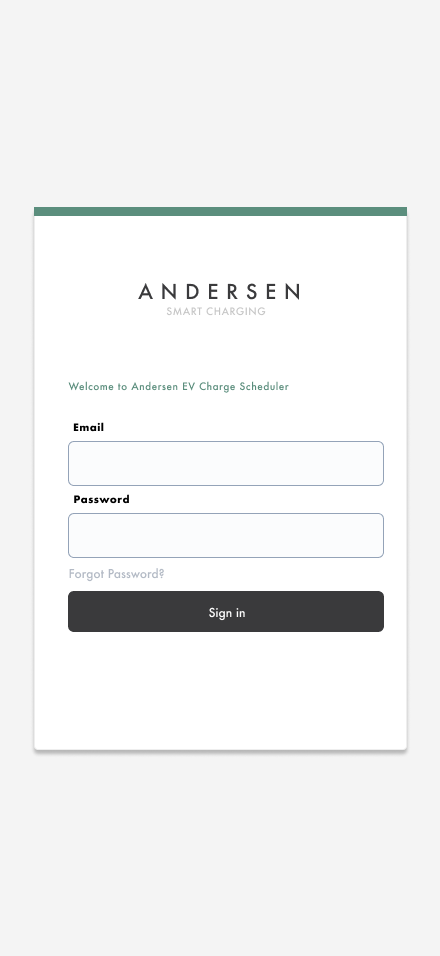
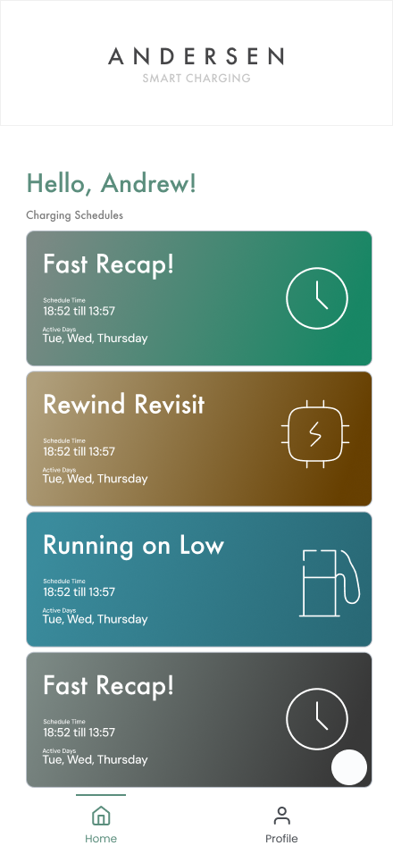
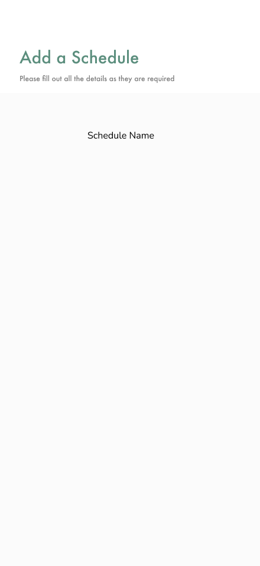

# Andersen EV App ⚡

Here are the images I designed before starting to visualize the app.  
After completing the designs, I installed **Expo** to start the application development.

---

## 📱 Application Overview

The **Andersen EV App** is a mobile application built with **React Native (Expo)**.  
It demonstrates user authentication, profile management, scheduling, and state management using **Redux**.

---

## 🚀 Features

- **Authentication**
    - Register a new account
    - Login with your credentials
    - Demo account available:
        - **Email:** `alex65287@gmail.com`
        - **Password:** `Summer102`

- **SQLite Integration**
    - Local database to store login and register details

- **Schedules**
    - Add, delete, and edit schedules

- **Profile**
    - Update and change profile details

- **State Management**
    - **Redux** used to maintain user data across the app
    - **LocalStorage** used to persist session (for demonstration — faster reads)

---

## 🛠 Tech Stack

- [Expo](https://expo.dev/) (React Native framework)
- [SQLite](https://docs.expo.dev/versions/latest/sdk/sqlite/) for local data storage
- [Redux](https://redux.js.org/) for state management
- LocalStorage (as an additional persistence layer)

---

## 📌 Improvements If I Had More Time

- Implement **Change Password** functionality
- Add **more animations** for better user experience
- Improve **state management architecture** to handle larger applications

---

## 🧭 Development Workflow (My Understanding)

1. **Design phase** → Created UI mockups and flows before coding.
2. **Setup** → Installed Expo and initialized the project.
3. **Database** → Integrated SQLite for handling authentication and schedules.
4. **State Management** → Added Redux for global state, LocalStorage for quick reads.
5. **Feature Development** → Built login/register, schedules CRUD, profile update.
6. **Created a workflow for .Git** → updates for now the package.json version not the release version.
7. **Refinement** → Focused on usability and tested with demo credentials.

---
## 🎨 Design Mockups
Here are the images I designed before starting to visualize the app:

  
  
